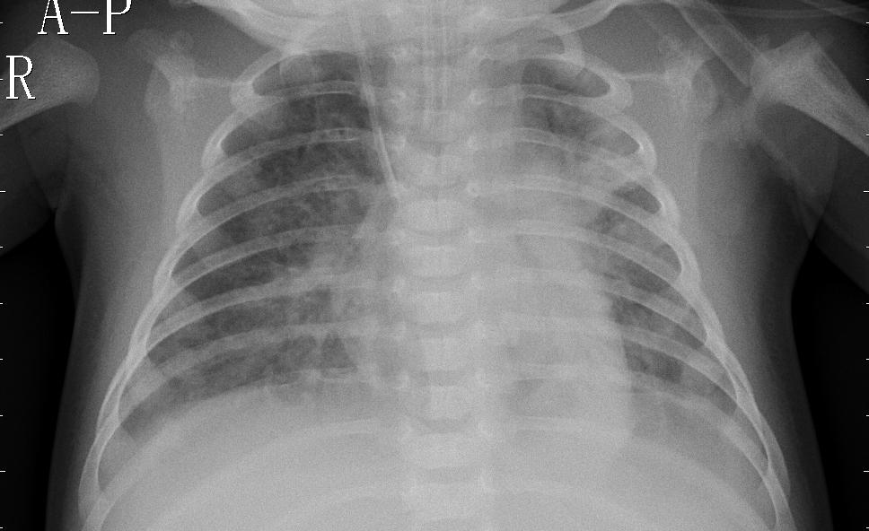
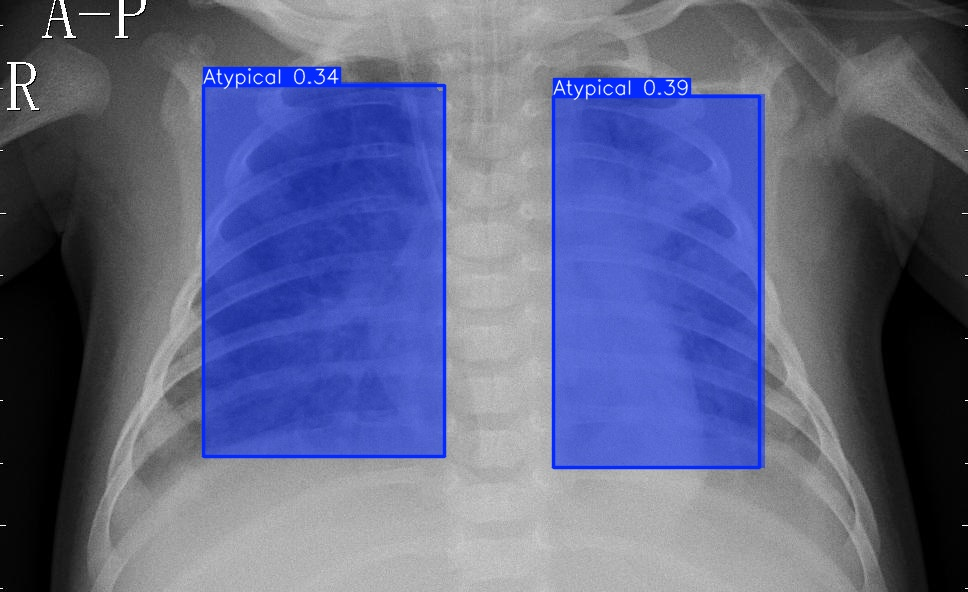
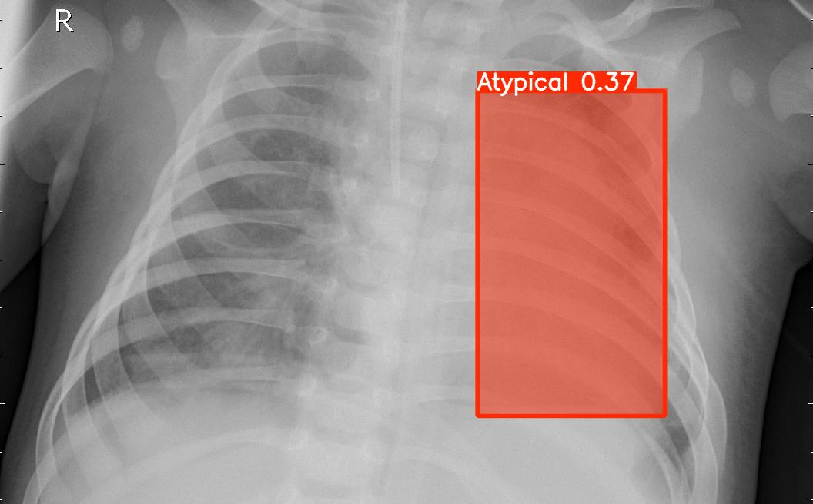
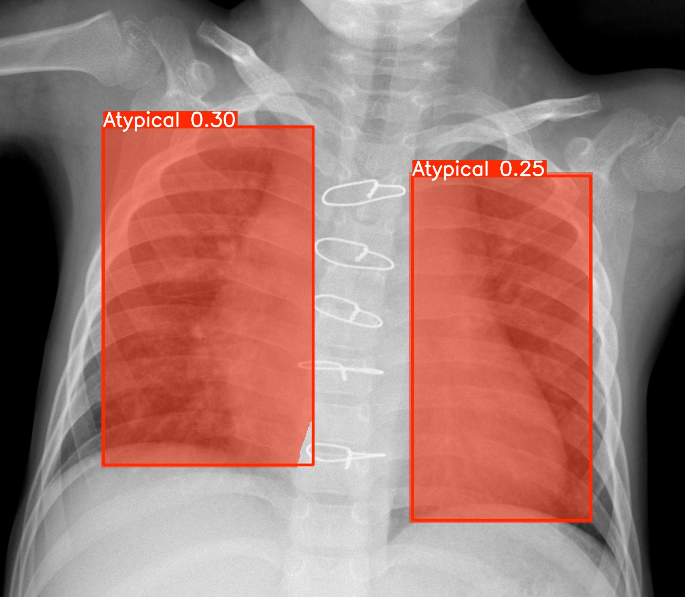

# 🏥 Production-Ready Medical Computer Vision Platform


---

## 📌 Overview

A production-oriented medical image segmentation system built using **FastAPI** and a custom-trained **YOLOv8 segmentation model**.

The platform enables users to upload chest X-ray images and visualize AI-generated segmentation outputs through a clean web interface.

This project demonstrates:

- Deep Learning Inference Pipeline  
- FastAPI Backend Architecture  
- YOLOv8 Segmentation Integration  
- Deployment-Ready Structure  

---

## 🖼️ Model Output Example

<p align="center">
  
  
      
        


</p>

**Left:** Original Chest X-ray  
**Right:** Segmentation Output generated by YOLOv8  

The model processes uploaded medical images and overlays segmentation masks on detected regions.

---

## 🏗️ System Architecture

User Upload  
⬇  
FastAPI Backend  
⬇  
YOLOv8 Segmentation Model  
⬇  
Processed Image Output  
⬇  
Web Interface Display  

This modular architecture separates backend logic from frontend rendering, making the system scalable and maintainable.

---

## 📂 Project Structure

```
medical-cv-ai/
│
├── app/
│   ├── main.py
│   └── __init__.py
│
├── ui/
│   └── index.html
│
├── assets/
│   ├── original.jpg
│   └── segmentation.jpg
│
├── models/          # Place best3.pt here (not included)
├── requirements.txt
├── .gitignore
├── LICENSE
└── Dockerfile
```

---

## 🧠 Model Setup

Due to size limitations, the trained YOLOv8 model is not included in this repository.

📥 Download the trained model from Google Drive:

👉 https://drive.google.com/file/d/16cG0GHD8yxdpXio0EgoD_Tz0qhWx5XOc/view?usp=sharing

### After downloading:

1️⃣ Create a folder named `models` in the project root (if not exists)

2️⃣ Place the file as:

```
models/best3.pt
```

---

## 📊 Model Evaluation

The model was validated during training using the built-in Ultralytics YOLOv8 validation pipeline.

Due to dataset availability restrictions, full evaluation metrics are not publicly included in this repository.

Evaluation can be reproduced using:

```python
from ultralytics import YOLO

model = YOLO("best3.pt")
model.val(data="data.yaml")
```

---

## ⚙️ Installation

### 1️⃣ Clone Repository

```bash
git clone https://github.com/YOUR-USERNAME/medical-cv-ai.git
cd medical-cv-ai
```

### 2️⃣ Install Dependencies

```bash
pip install -r requirements.txt
```

---

## ▶️ Run Application

```bash
uvicorn app.main:app --reload
```

Open in browser:

```
http://127.0.0.1:8000
```

---

## 🐳 Docker Deployment

Build Docker image:

```bash
docker build -t medical-ai .
```

Run container:

```bash
docker run -p 8000:8000 medical-ai
```

---

## 🚀 Future Improvements

- Cloud Deployment (Render / AWS / GCP)  
- Multi-Class Medical Detection  
- Explainable AI Heatmaps  
- Performance Monitoring Dashboard  
- GPU-Optimized Deployment  

---

## 👨‍💻 Author

Your Name  
AI & Computer Vision Engineer  

---

## 📜 License

This project is licensed under the MIT License.
